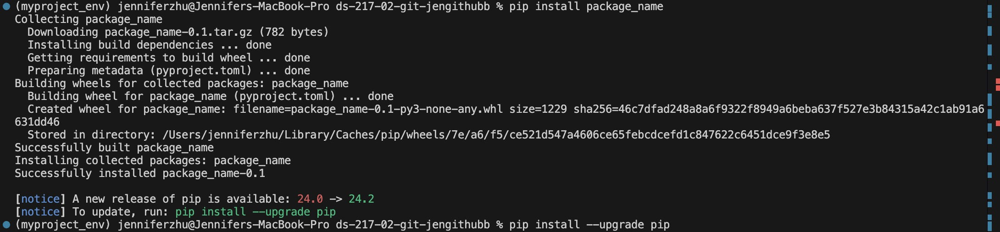

# Assigement 2
## GitHub username
jengithubb

# - Answer to the problem above + script you wrote to solve it

# - Brief introduction (who are you, why are you here, anything you’re specifically hoping to get out of the course)
My name is Jennifer Zhu, and I’m a first-year student in the Health Data Science program. I’m here to gain more knowledge about data science and develop a strong understanding of how Python is applied in the industry. I hope to become fluent in using Python as a tool for data management and visualization. Additionally, I’m eager to learn key data science concepts and explore basic machine learning techniques.

# - Link to Python official website
https://www.python.org!

# - Screenshot of package install using pip

# - Meme image

